# 🧵 DarziDesk: Master Documentation Index & Role-Based Manual
*(Complete Enterprise Tailoring & Boutique Management Software)*

---

## 🌟 Welcome to DarziDesk Documentation

DarziDesk ek modern, cloud-based **Tailoring & Boutique Management Software (TMS)** hai jo bespoke tailoring studios, luxury designers, bridal boutiques aur custom tailoring factories ke sabhi operations ko digitally automate karta hai.

---

## 📚 Complete Role-Based Documentation Guides

Neeche diye gaye individual role documents me har ek feature ka **Purpose (Kyun Hai)**, **Working (Kaise Kaam Karta Hai)**, aur **Business Benefit (Fayda)** step-by-step Hinglish me explain kiya gaya hai:

| Role Name | Description & Target Audience | Direct Guide Link |
| :--- | :--- | :--- |
| 👑 **Super Admin** | Platform Owner, SaaS Subscriptions, Tenant Onboarding, Payment Gateways, CMS, Blog SEO & Global Settings | 📖 [SUPER_ADMIN_GUIDE.md](file:///Users/naimish/projects/learning-projects/darzidesk-tms/docs/SUPER_ADMIN_GUIDE.md) |
| 👔 **Boutique Owner** | Shop Admin, 3D Measurements, Multi-Step Orders, POS Invoicing, Kanban Pipeline, Karigar Ledgers, Inventory, P&L Reports & WhatsApp Alerts | 📖 [BOUTIQUE_OWNER_GUIDE.md](file:///Users/naimish/projects/learning-projects/darzidesk-tms/docs/BOUTIQUE_OWNER_GUIDE.md) |
| ✂️ **Employee & Staff** | Master Cutter, Coat Specialist, Trouser Karigar, Embroidery Artisan, Workshop Job Cards, Stage Tracking & Wage Statements | 📖 [EMPLOYEE_STAFF_GUIDE.md](file:///Users/naimish/projects/learning-projects/darzidesk-tms/docs/EMPLOYEE_STAFF_GUIDE.md) |
| 📱 **Customer Portal** | End Clients, Live Order Progress Bar, Digital 3D Measurement Passport, PDF Invoices & Master Tailor Appointment Booking | 📖 [CUSTOMER_PORTAL_GUIDE.md](file:///Users/naimish/projects/learning-projects/darzidesk-tms/docs/CUSTOMER_PORTAL_GUIDE.md) |

---

## 🔄 DarziDesk Multi-Tenant Architecture

```mermaid
graph TD
    SuperAdmin["👑 Super Admin (Platform Owner)"]
    SuperAdmin -->|Manages SaaS Subscriptions| Tenant1["👔 Boutique Owner A (Delhi Studio)"]
    SuperAdmin -->|Manages SaaS Subscriptions| Tenant2["👔 Boutique Owner B (Mumbai Atelier)"]
    
    Tenant1 -->|Assigns Job Cards| MasterCutter["✂️ Master Cutter (Cutting Desk)"]
    Tenant1 -->|Assigns Stitching Tasks| Karigar["🧵 Tailor / Karigar (Workstation)"]
    Tenant1 -->|Counter Billing & Delivery| Client["📱 End Customer (Client Portal)"]
    
    MasterCutter -->|Updates Stage: Cutting Done| Kanban["🎛️ Production Kanban Pipeline"]
    Karigar -->|Updates Stage: Stitched| Kanban
    Kanban -->|Automated Trigger| WhatsApp["💬 WhatsApp / SMS Gateway"]
    WhatsApp -->|Sends Live Progress Notification| Client
```

---

## 📖 Key Terminology Glossary (Hinglish)

1. **Measurement Passport**: Customer ke exact body parameters (Chest, Waist, Inseam, Neck, Slope, Bicep) ka digital cloud record jo har bar repeat orders me use hota hai.
2. **Digital Job Card**: Garment ke sath workshop me bheja jane wala instruction tag jisme customer ka style, fabric code, lining aur cutting specifications hote hain.
3. **Production Kanban**: Shop floor ka visual drag-and-drop board jahan kapde apne current manufacturing stage (Cutting $\rightarrow$ Stitching $\rightarrow$ Trial $\rightarrow$ Finishing) me dikhte hain.
4. **Tailor Ledger**: Karigar ki piece-rate silayi mazdoori aur beech-hafte liye gaye kharche/advance cash ka automated credit/debit hisab.
5. **POS Billing**: Counter par instant advance receipt ya final delivery bill generate karne ka Point of Sale system.
6. **Multi-Tenancy (`parent_id`)**: DarziDesk ka data security engine jo ensure karta hai ki ek boutique ka data doosre boutique ko kabhi na dikhe.

---

## 🛠️ Verification & System Health
- **Routes & Middleware**: 100% verified with role authorization guards.
- **Dark & Light Mode Support**: Cohesive `#0B2239` Navy & `#D9A441` Gold theme.
- **Mobile Responsive**: Fully verified across iOS, Android, and Desktop browsers.
